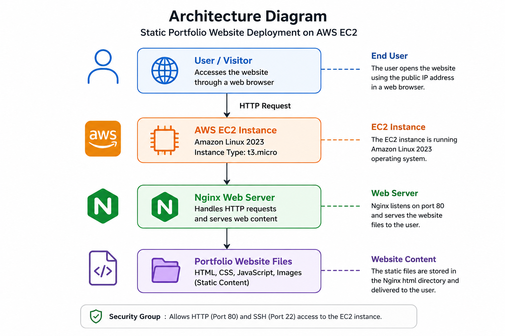
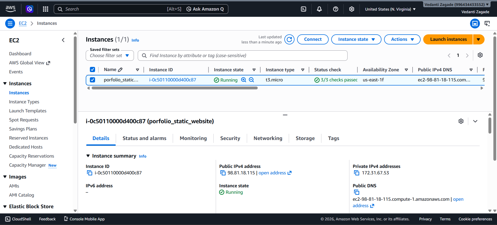
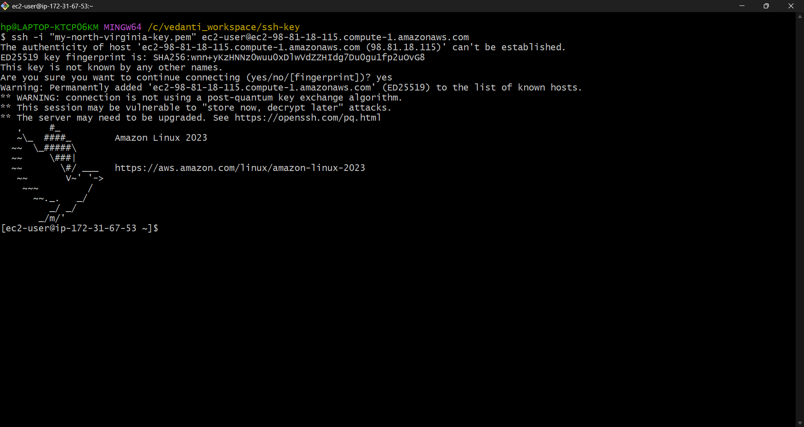
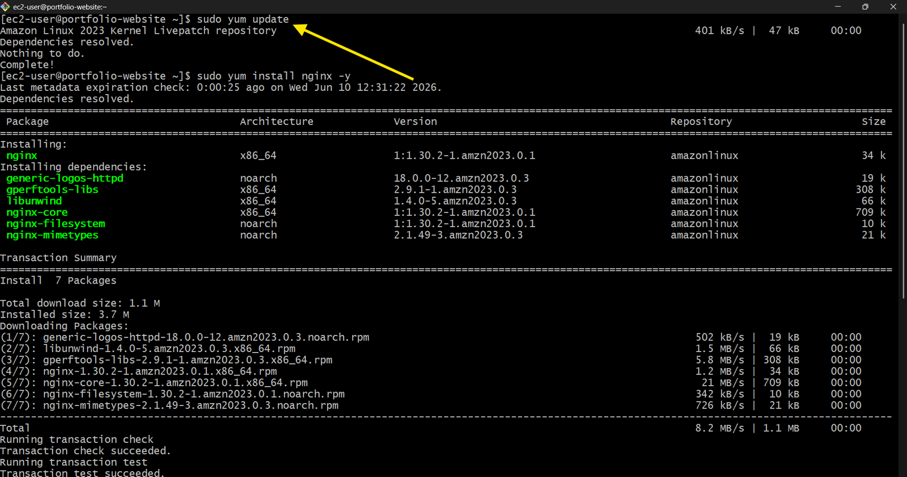
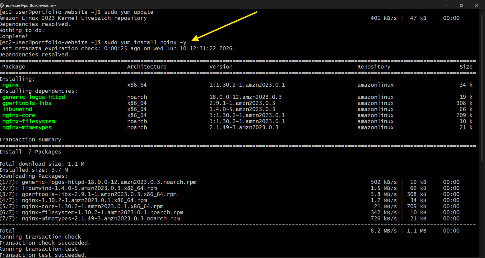
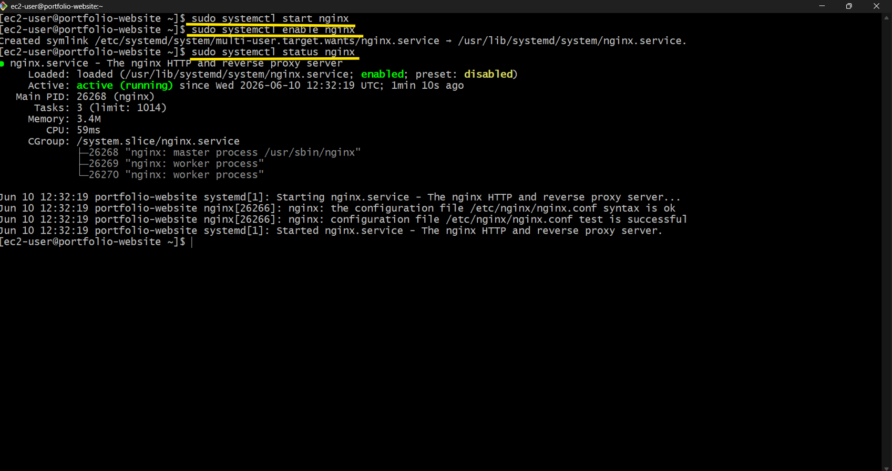
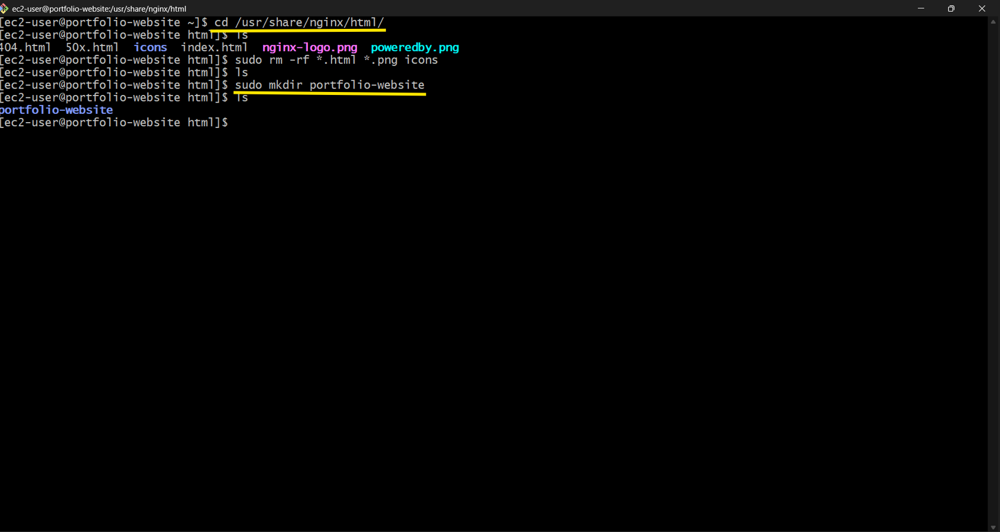
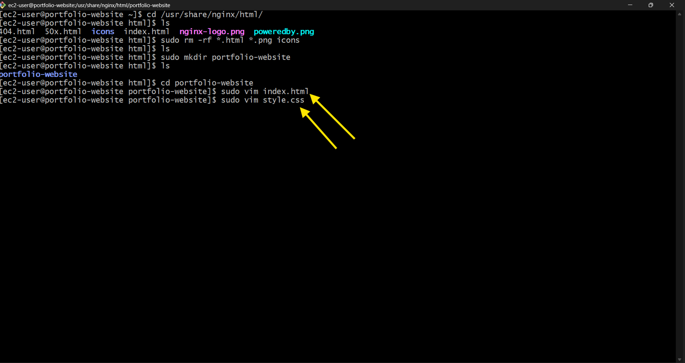
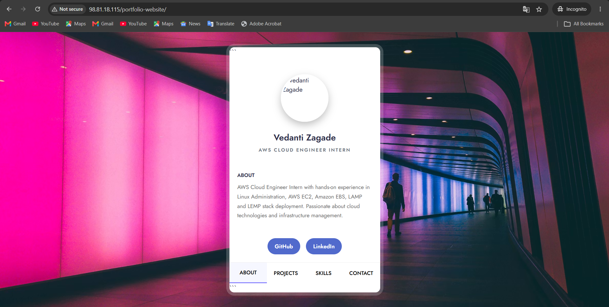

# **AWS EC2 Static Website Hosting using Nginx**
## **Project Introduction**
This project demonstrates the deployment of a static portfolio website on Amazon EC2 using Amazon Linux 2023 and Nginx. The primary objective was to gain hands-on experience with AWS cloud services, Linux server administration, web server configuration, and website hosting.

The project involved launching and configuring an EC2 instance, establishing secure SSH connectivity, installing and managing the Nginx web server, and hosting a static portfolio website accessible through a public IP address. Throughout the deployment process, various Linux commands and server management practices were used to configure the environment and ensure proper website functionality.

By completing this project, I gained practical experience in AWS EC2, Linux administration, SSH connectivity, Nginx configuration, website hosting, and cloud infrastructure management. This project served as a foundation for understanding real-world cloud deployment workflows and DevOps practices.


This project helped me gain hands-on experience with:

- AWS EC2
- Linux Commands
- Nginx Web Server
- SSH Connectivity
- Website Hosting
- Basic Web Deployment

## **Architecture**


## **Technologies Used**
- AWS EC2
- Amazon Linux 2023
- Nginx
- HTML
- CSS
- JavaScript
- ChatGPT (for website generation)

## **Instance Configuration**

| Component | Details |
|-----------|---------|
| Cloud Provider | AWS |
| Service | EC2 |
| Operating System | Amazon Linux 2023 |
| Instance Type | t3.micro |
| Web Server | Nginx |
| Website Type | Static Portfolio Website |
| Access Method | SSH |
|
## **Deployment Steps**
### **1. Launch EC2 Instance**
Created an EC2 instance using Amazon Linux 2023 and t3.micro instance type.



### **2. Connect to EC2**
Connected securely using SSH and key pair authentication.



### **3. Update Server**
Updated all system packages before deployment.
```
sudo yum update -y
```

### **4. Install Nginx**
Installed Nginx web server.
```
sudo yum install nginx -y
```

### **5. Start Nginx Service**
Started and enabled the Nginx service.
```
sudo systemctl start nginx 
sudo systemctl enable nginx
```
Checked service status.
```
sudo systemctl status nginx
```

### **6. Create Website Directory**
Created a dedicated directory for the portfolio website.
```
cd /usr/share/nginx/html 
sudo mkdir portfolio-website
```

### **7. Create Website Files**
Created:

- index.html
- style.css
- script.js

using the Vim editor.


### **8. Deploy Website**
Placed all website files inside the Nginx web root directory and served them through Nginx.
### **9. Access Website**
Accessed the website using the EC2 Public IPv4 address.



## **Learning Outcomes**
Through this project, I learned:

- Launching and configuring EC2 instances
- Connecting to Linux servers using SSH
- Installing and managing Nginx
- Hosting static websites on AWS
- Managing website files through the Linux terminal
- Understanding basic cloud deployment workflows
## **Summary**
This project showcases the deployment of a static portfolio website on an Amazon EC2 instance using Amazon Linux 2023 and Nginx. The deployment process included launching and configuring the EC2 instance, establishing secure SSH access, installing and managing the Nginx web server, and hosting the website in a cloud environment.

Throughout the project, I gained practical experience with AWS EC2, Linux server administration, SSH connectivity, web server configuration, and static website hosting. This hands-on implementation strengthened my understanding of cloud infrastructure, deployment workflows, and the fundamental concepts of AWS and DevOps practices.


